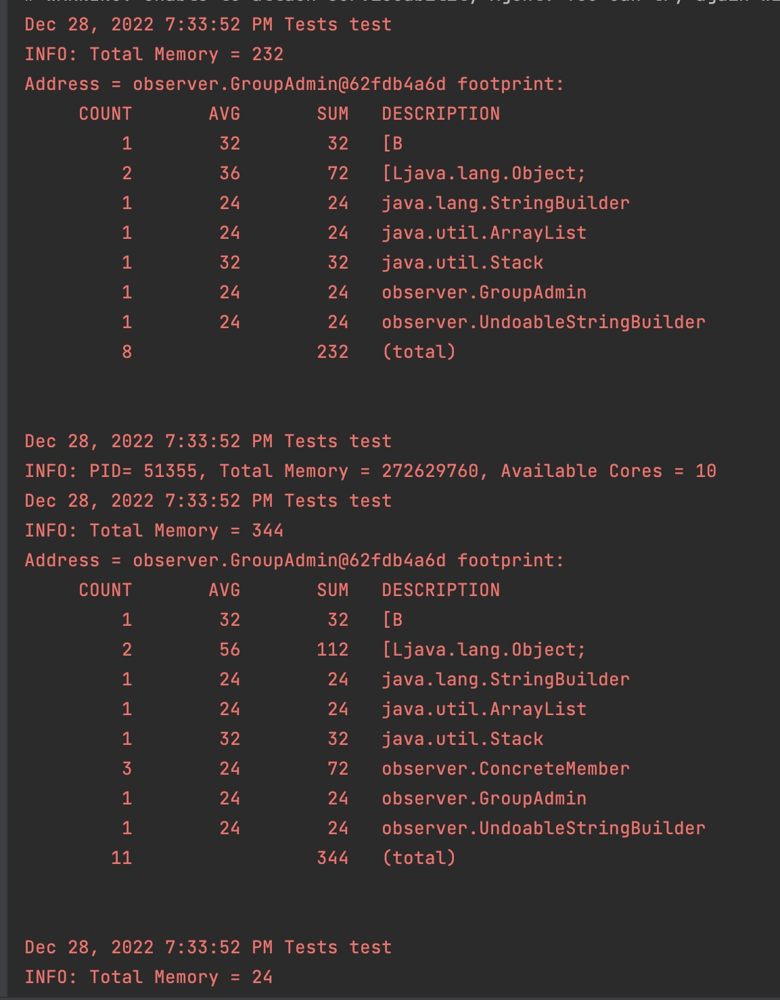
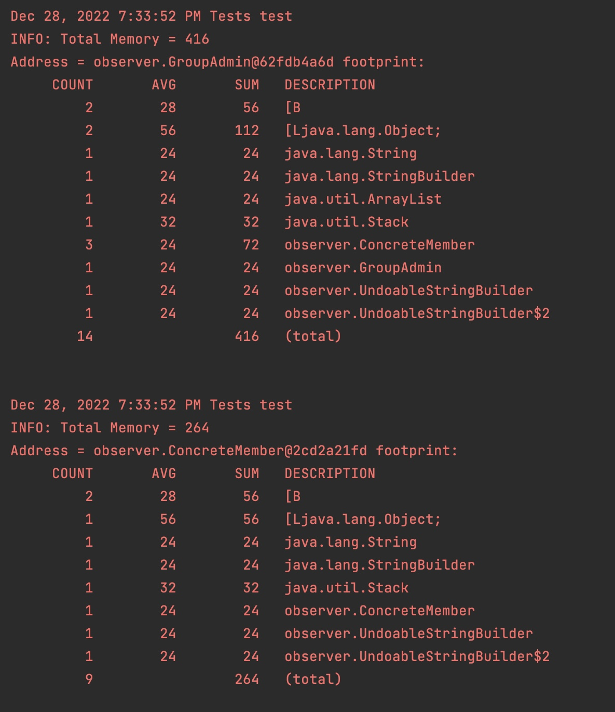
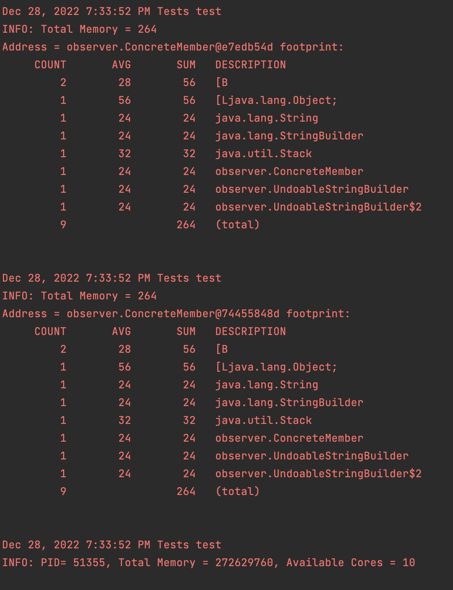

# Assignment1ObjectOriented
<!-- Improved compatibility of back to top link: See: https://github.com/othneildrew/Best-README-Template/pull/73 -->

<!--
*** Thanks for checking out the Best-README-Template. If you have a suggestion
*** that would make this better, please fork the repo and create a pull request
*** or simply open an issue with the tag "enhancement".
*** Don't forget to give the project a star!
*** Thanks again! Now go create something AMAZING! :D
-->

<!-- PROJECT LOGO -->
 

  

<h3 align="center">Observer and Observables</h3>

  

    
    we build a design pattern code of Observer and Observables.
    
  

<!-- TABLE OF CONTENTS -->

  
Table of Contents

  <ol>
    <li>
      <a href="#about-the-project">About The Project</a>
      <ul>
   

<!-- ABOUT THE PROJECT -->
## About The Project
we build a design pattern code that contains a sender and members interface in which we 
implement the sender in groopAdmin class,
and the member in concrete member class.
the groopAdmin goal is to make a messege and update the members of that msg.  

<!-- GETTING STARTED -->
## Getting Started

First we need to build a groop admin and concrete members so we can registar members to his list of subscribers.
After that we will have an option to make strings with undoStringBuilder and update oure members.
all the optinals changes we can do on the string builder is alredy expained in oure code.

<!-- USAGE EXAMPLES -->
## Usage
we use maven to track the memory system footprint(mamory changes behind the sence)
      
     1. in the first pic we can see the test code.
     we used JvmUtilities class for the function.
 
   

         
        
   
      
        
     2. here we see the first print of the groopAdmin footprint.
      as you can see in the first footprint we initialize one stack (UndoStringBilder) ,one array list,one stringBuilder,and some reserve.
      in a sum mem total of 232.
      after we added the three concreteMembers.
      we cam see in the secomd picture that 3 concreteMember added to the memory and also the reserve got biger.
      in a sum mem total of 344.
  
       
         
   
      
     3.this is after the test we append and insert some strings, and we can see that memory added to
      oure list "string" line of the string in oure StringBilder.
   
   
     
     
     

 

<!-- CONTRIBUTING -->
## Made by moshe nahshon and yogev ofir 

